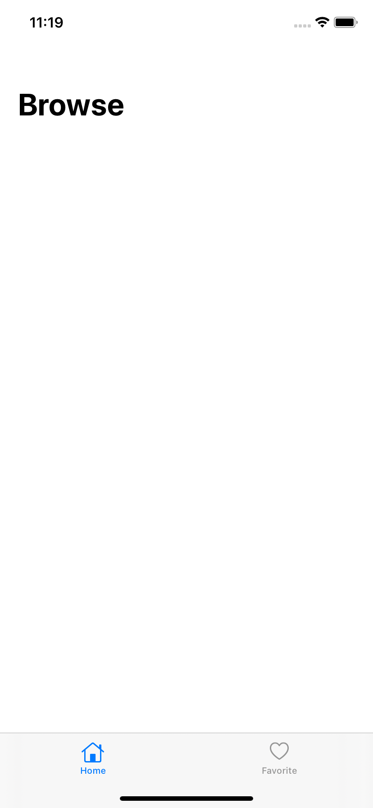
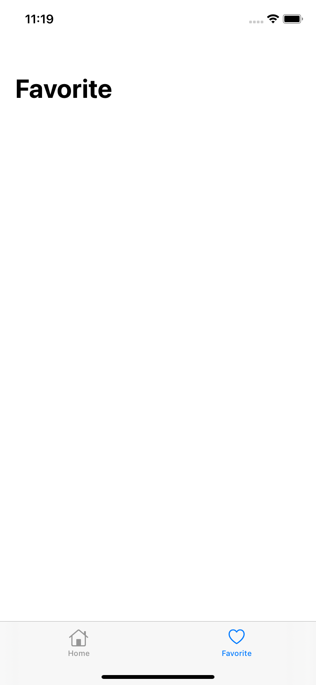

# Bible Study Guide
[](https://app.fossa.com/projects/git%2Bgithub.com%2FDevAgani%2FBibleStudyGuide?ref=badge_shield)


A Simple application with intuitive UI aimed to be a Christian Companion in their christian walk, be it in the private Bible Study time or whenever they are doing a Door-to-Door effort

## Getting Started

These instructions will get you a copy of the project up and running on your local machine for development and testing purposes.

## Screenshots




### Prerequisites
- Xcode
- Working knowledge of Swift Language and iOS Development

### Setup

Setup is quite simple:

```bash
$ git clone https://github.com/DevAgani/BibleStudyGuide.git 
$ cd BibleStudyGuide 
```
> This will get you a local copy of the project. All you need to do is open xcode and run the application

### How to use

A step by step guide on how to use the app's features

End with a few screenshots

## Built with

* [Swift 5](https://developer.apple.com/swift/) - The programming language used
*  Design Pattern

## Authors

**George Nyakundi** 
[](https://www.linkedin.com/in/georgenyakundi/)&nbsp;&nbsp;&nbsp;&nbsp;&nbsp;
[](https://twitter.com/agani_dev)

## License


[](https://app.fossa.com/projects/git%2Bgithub.com%2FDevAgani%2FBibleStudyGuide?ref=badge_large)

## Acknowledgments
* Inspiration :-